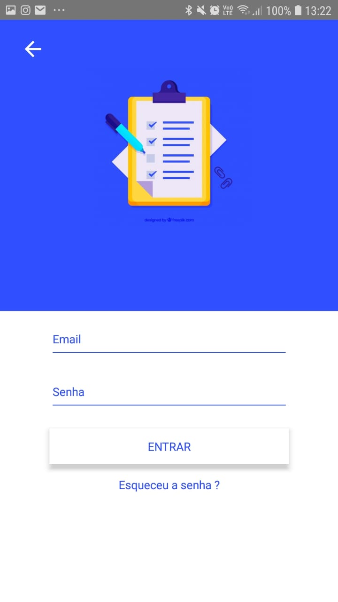
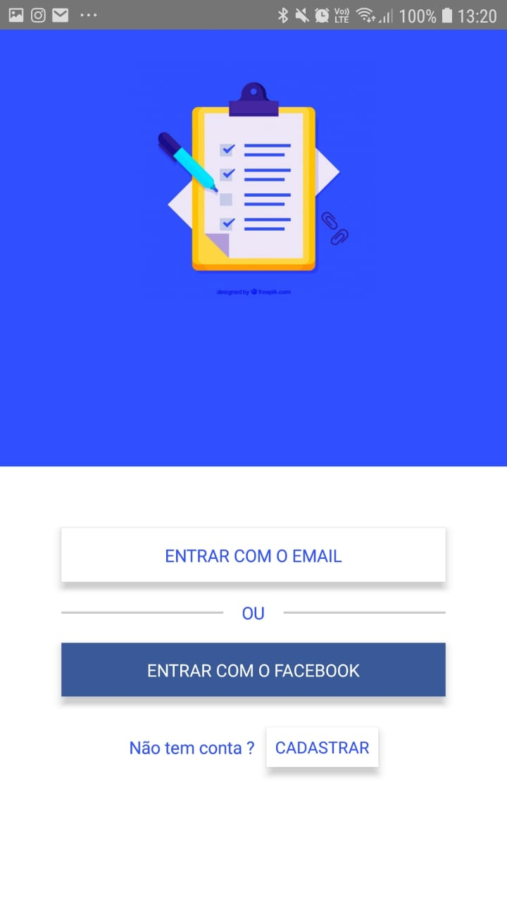
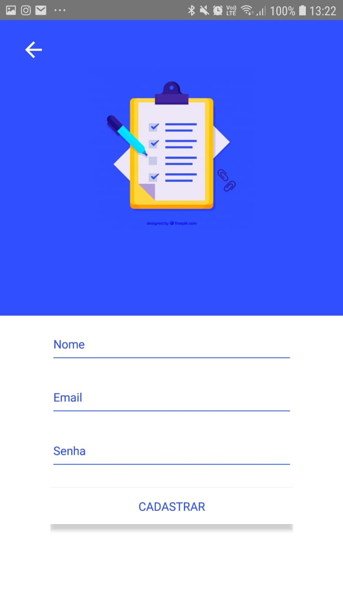
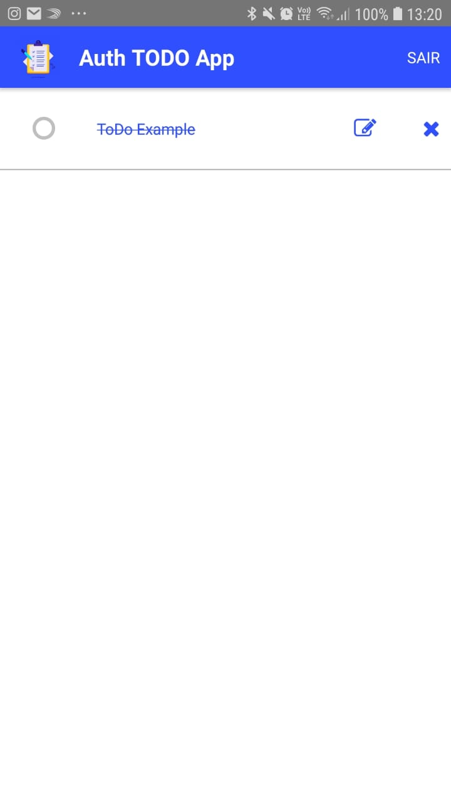

# Authentication and TODO - React Native App

### Simple app with authentication and TODO on Firebase

[Auth TODO App - APK DOWNLOAD](https://drive.google.com/file/d/19EyYvxxHk0WM6C6VQvvENPSPpCI1v6FU/view?usp=sharing)

## Main features:
- Login screen that authenticate with Facebook and Email method by Firebase
- Sign Up screen that create account with Facebook and Email method  by Firebase
- Use Firebase Realtime database and Firebase Authentication
- A todo **crud** that should **synchronize** with [firebase realtime database]


## The Project 

- Use [ES6](http://es6-features.org/#Constants)
- Use [React ](https://reactjs.org/)
- Use [React Native ](https://facebook.github.io/react-native/)
- Use [Redux](https://redux.js.org/)


#### Third-party Libraries
- [redux-thunk](https://github.com/reduxjs/redux-thunk) : A middleware for Redux
- [react-native-localization](https://developer.android.com/topic/libraries/support-library/index.html): Library to internalization strings.
- [react-navigation](https://reactnavigation.org/) : To routing and navigation 
- [react native elements](https://react-native-training.github.io/react-native-elements/) : To use native UI components
- [axios](https://github.com/axios/axios) : To make XMLHttpRequests, Intercept request and response, Automatic transforms for JSON data, Supports the Promise API
- [momentjs](https://momentjs.com/) : To parse, validate, manipulate, and display dates and times in JavaScript.

### Tools and Run

This project was built using Visual Studio Code. To edit this project, is recomended to use the *Open folder* from Visual Studio Code.

To run project, you requires :
- NodeJS
- Yarn or NPM
- Java 8


In the project directory, to install dependencies you can run:

- ### `yarn`

After you can start the development server :

- ### `yarn start`

And with android device connected in another terminal session, run project with the command : 
- ### `yarn android`


#### Build Enviroments
In the app two environments were developed to run the application, API and MOCK. The MOCK environment performs requests and receives responses with false but functional data for the project. The API environment performs requests and receives responses through the firebase by performing HTTP requests to the server, bringing real and dynamic data simulating a real use of the project.

To set app enviroment you should change the file : (./src/services/ServiceDataSource.js)

```
  constructor(mockDatasource, apiDataSource) {
    this.BUILD_TYPE = BUILD_TYPES.API // on BUILD_TYPES you can use MOCK or API enviroment .
    this.mockDatasource = mockDatasource
    this.apiDataSource = apiDataSource
  }
```

PS: To run project on API build type you need define .env variables to firebase credentials .


## Screens


 Doing Email Sign In       |  Doing Facebook Sign In          | Sign Up with Email                   
:-------------------------:|:-------------------------:|:-------------------------:|
  |      |     


 Listing Todo's             |  Adding Todo             | Removing Todo        | Editing Todo   | Completing Todo                
:-------------------------:|:-------------------------:|:-------------------------:|:-------------------------:|:-------------------------:|
  |    |    |    |    


© Denis Vieira Rufino
